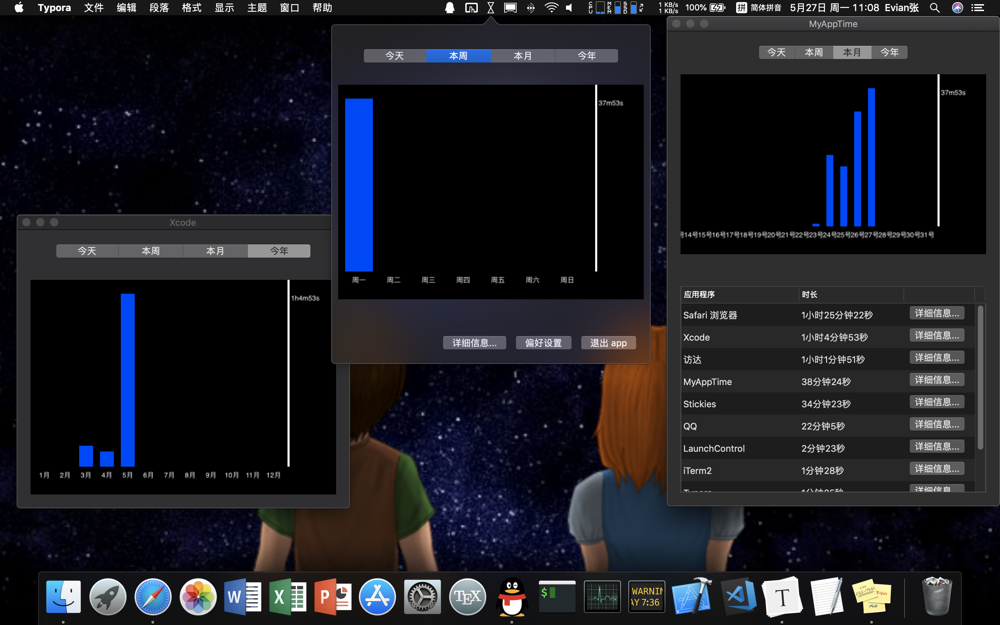
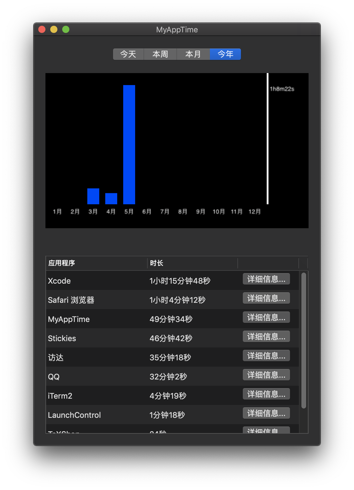
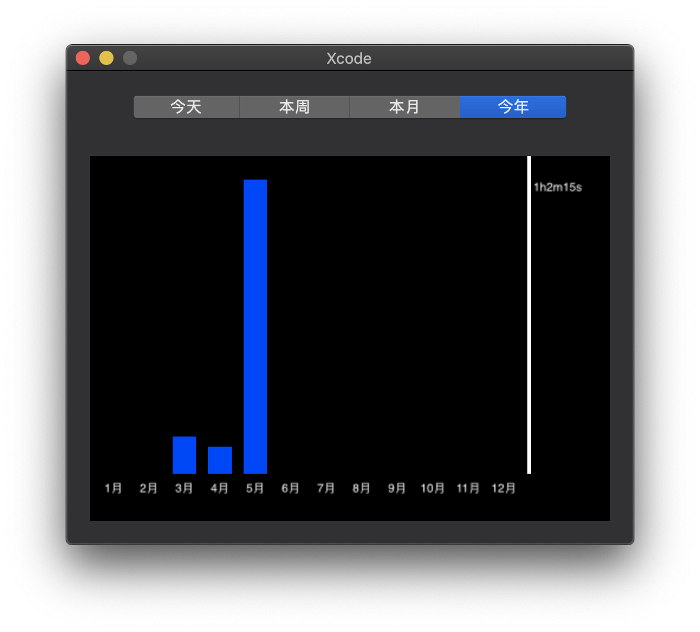

#  MyAppTime
这是一款 macOS 上类似于 iOS 中“屏幕使用时间”的免费软件。下载地址: [MyAppTime.dmg](https://github.com/Evian-Zhang/MyAppTime/releases/download/v1/MyAppTime.dmg). 本应用使用 Objective-C, 利用 cocoa 框架写成，源码可在本仓库中查看。

## 介绍

本应用从您启动您的Mac开始，记录您使用各软件的时长，并可以按今日、本周、本月、今年等模式以柱状图的形式展现。同时，您也可以查看在当前时间段使用最频繁的应用程序。

在偏好设置中，您也可以更高级地控制本应用。如添加忽略的 bundle ID, 使应用不记录对应应用的使用时长，这一点在用户习惯于在桌面上留有便签等情况下十分好用。同时，您也可以查看原始数据，并进行删除。

## 实现原理

统计使用时间的核心代码是`ATDataModel`类中的`- (NSMutableArray<NSString *> *)bundleIDs`方法，其代码如下：

```objective-c
- (NSMutableArray<NSString *> *)bundleIDs {
    NSMutableArray<NSString *> *bundleIDs = [NSMutableArray<NSString *> array];
    
    NSMutableArray *windowDicts = (__bridge NSMutableArray *)CGWindowListCopyWindowInfo(kCGWindowListOptionOnScreenOnly | kCGWindowListExcludeDesktopElements, kCGNullWindowID);
    
    if (![bundleIDs containsObject:ATTotalTime]) {
        [bundleIDs addObject:ATTotalTime];
    }
    
    for (NSDictionary *windowDict in windowDicts) {
        NSString *windowLayer = (NSString *)[windowDict objectForKey:@"kCGWindowLayer"];
        if (!windowLayer.intValue) {
            NSString *pidString = (NSString *)[windowDict objectForKey:@"kCGWindowOwnerPID"];
            pid_t pid = pidString.intValue;
            NSRunningApplication *runningApplication = [NSRunningApplication runningApplicationWithProcessIdentifier:pid];
            NSString *bundleID = runningApplication.bundleIdentifier;
            if (bundleID) {
                if (![bundleIDs containsObject:bundleID]) {
                    [bundleIDs addObject:bundleID];
                }
            }
        }
    }
    
    return bundleIDs;
}
```

其原理就是通过`CGWindowListCopyWindowInfo()`函数，返回当前桌面上所有窗口是可见的应用。然后我通过存储该应用的 bundle ID (也就是该应用的唯一标识符), 避免了应用改名字这类问题。

然后，我通过设置`_refreshInterval = 1.0`, `_writeBackInterval = 1800.0`, 来控制其使用频率。也就是说，在每过一个`_refreshInterval` （这里设置为1秒）, 该应用统计一次在使用的所有应用，并存在`self.timeRecordings`数组中。然后每过一个`_writeBackInterval` （这里设置为半小时），将数组写入数据库中。

## 使用截图








## Bug 反馈

如果您在使用期间发现了 bug, 请用邮箱与我联系。我的邮箱: evianzhang1999@gmail.com

## 捐赠

您对我的每一分捐赠，都是对我莫大的鼓励！


